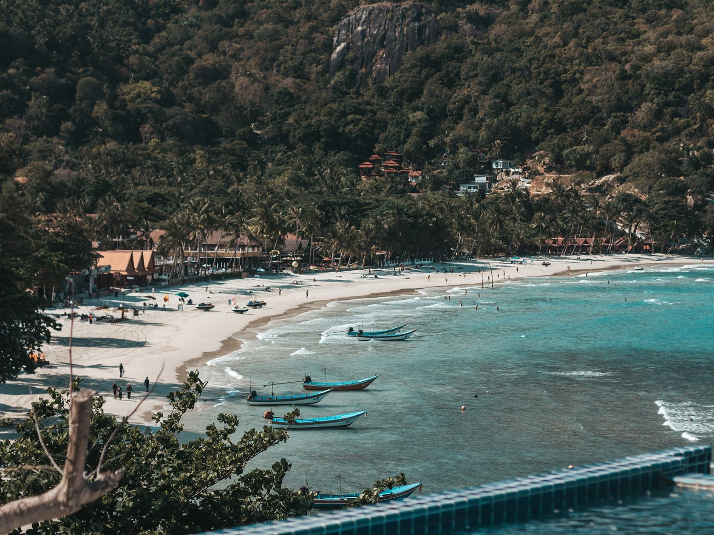

Остров Панган - это место с множеством красивых и разнообразных пляжей. Некоторые из них являются идеальным местом для отдыха с детьми, другие подходят для водных видов спорта, а еще другие - для ночной жизни. Наш гид поможет вам выбрать идеальный пляж для ваших потребностей и предпочтений.

## Северные пляжи

### [Пляж Малибу (Malibu)](https://goo.gl/maps/aageQTYzuq3s9uh17)

На севере Пангана находится пляж Малибу. Белый и очень мелкий песок. Пляж идеальный для детей и красивых фотографий. Пляж мелкий, почти без волн. Однако на Малибу можно быть покусанным песчаными мошками. На острове ходит поверие, что мошки кусают только самых врендых. Есть целая одна кафешка и сетка для пляжного волейбола. За 5−7 минут можно дойти до соседнего пляжа Чалоклам.

### [Пляж Coconut (Haad Knom)](https://goo.gl/maps/BmcFsGZXoEt7DeQc6)

Пляж Haad Khom известен как Coconut или Coral Bay. Можно понырять с маской — на дне кораллы, рыбы, камни. И живет большая ручная свинка Dukdik, на которую все едут посмотреть.

## Западные пляжи

### [Пляж Хад Яо (Haad Yao)](https://goo.gl/maps/WZd6BtRHcuXPbXut9)

Пляж Хад Яо очень широкий, с белым песком и пальмами. Много резортов, кафе, массажных салонов и развлечений. В низкий сезон бывают сильные отливы. В 15 метрах от берега есть рифы. А еще на Хад Яо просто волшебные закаты.

### [Пляж Secret Beach (Haad Son)](https://goo.gl/maps/wbFPhgcsVNRiypFw9)

Secret Beach или Haad Son — маленький пляж с чистым дном, и вторым диким пляжем за скалами слева. Там же находится отличное кафе Koh Raham, откуда можно понырять.

### [Пляж Дзен (Zen Beach)](https://goo.gl/maps/Rt6SAQedPqQ1NSh67)

В районе Шритану на западе острова находится Зен Бич (он же Дзен). Отличное место встречать закат. Около 18 часов на пляже собираются музыканты и йоги. Часто после заката бывает костер и файр-шоу. На пляже есть два кафе. Справа от него находится неофициальный нудистский пляж.

## Восточные пляжи

### [Пляж Хадрин (Haad Rin)](https://www.google.ru/maps/place/Haad+Rin/@9.6769166,100.0658638,17z/data=!3m1!4b1!4m5!3m4!1s0x3054fcba5f9a3c17:0xa753bd2c098cab12!8m2!3d9.6769113!4d100.0680525?hl=ru)

Haad Rin большой широкий и довольно глубокий пляж. Дорога на Хадрин идет через горки. Если ваш стаж вождения меньше месяца — самому лучше не ехать. В сухой сезон с апреля по август это один из немногих пляжей с нормальным уровнем воды. На пляже много баров, ресторанов. А также водных развлечений, например JetSki. Отсюда ходят лодки до соседних пляжей — WaiNam и Haad Yuan. Здесь раз в месяц проводится Full Moon Party. Для любителей не просто купаться, а плавать — осторожно, на пляже есть обратные течения. Также на Хадрине стоит онлайн-камера.

<!-- 

 -->

### [Пляж Хаад Юань (Haad Yuan)](https://goo.gl/maps/9PnukMxBTnV62zM9A)

Пляж Хаад Юань (Haad Yuan) первый из трех восточных труднодоступных тусовочных пляжей. По выходным (с пятницы до воскресенья) это место пати. А в рабочие дни это удивительно красивые пляжи. Добраться можно на лодке от Хадрина (от 300 бат с человека). Либо пешком за пару часов через джунгли. Не забывайте закрытую одежду и антимоскитный спрей.

Тропинка: вы стоите на Хадрине спиной к 7/11 и лицом к недостроенному зданию. Видите дорожку между зданием и забором. Идёте по ней ~150 метров и выходите к бунгало. Между бунгало поляна. Посреди поляны тропинка, в начале её указатель. На маршруте есть флуоресцентные указатели, которые светятся ночью.

### [Пляж Haad Tien (Haad Thien) East](https://goo.gl/maps/G7JsKGYbRKC3Ry9w5)

Пляж Haad Tien восточный (так как есть еще западный Haad Tien West) – второй из тусовочных субботних пляжей. Там находится Guy's Bar. Как добраться до пляжа — читайте выше описание Haad Yuan.

### [Пляж Вайнам (Why Nam)](https://goo.gl/maps/k8mk2xqqvFASYU1f9)

Пляж Вайнам (Wai Nam или Why Nam) — третий из дальних восточных тусовочных и невероятно красивых пляжей. Каждую субботу тут собираются красивые и талантливые люди для того, чтобы поплавать, покрутить хула-хуп, устроить файр-шоу под очень классную часто живую музыку. Как добраться до пляжа — читайте выше описание Haad Yuan.

### [Пляж Мае Хад (Ko Ma)](https://goo.gl/maps/nYkQRqBzp1UVxWd29)

Пляж Mae Haad больше известен как Ko Ma — по названию небольшого необитаемого острова рядом с ним. На отливе по косе можно дойти до соседнего острова. Слева от острова неплохая точка для снорклинга. Высоко над пляжем есть бар [360](https://goo.gl/maps/VLe1A8kXomSWQdcD6) (Three Sixty), откуда получаются шикарные фотографии заката и острова.

### [Пляж Bottle Beach](https://goo.gl/maps/hqYV78XumXknARoPA)

Bottle Beach (официально Ao Haad Khuat) - красивый длинный и труднодоступный пляж для любителей тюленьего отдыха и красивых фото. Есть несколько резортов, кафе и даже прокат каяков.

До пляжа Bottle Beach добраться не так просто. Самый простой способ – доплыть за 150 бат на лодке от Чалоклама. Можно пройти по джунглям пешей тропой за час-полтора. Можно доехать до [стоянки байков](https://goo.gl/maps/d5weXRCmUuAtVXiq5) и дойти до пляжа пешком за 20 минут. Но если у вас свой байк, либо вы арендовали Эндуро — это развлечение как раз для вас. Главное не езжайте в дождь, дорога очень плохая.

### [Пляж Thong Nai Pan Yai](https://goo.gl/maps/o5RmvigzHLHhey7s6)

Тон Най Пан (южный) - уютный широкий пляж на северо-востоке острова. Мелкий белый песок, отсутствие ежей и камней при заходе в море делает его очень комфортным для купания. Как и многие пляжи на Пангане в отлив мелеет, отчего в солнечные дни вода становится как парное молоко. После 14:00 можно найти место в тени под пальмами. Идеально подойдет для купания с детьми.

### [Пляж Thong Nai Pan Noi](https://goo.gl/maps/y7aLRjXpLYveKNwt9)

Тон Най Пан (северный). Если вы хотите попасть на пляж, отличающийся от остальных, вам сюда. Крупный чистый песок золотистого цвета, ухоженная береговая линия и чистота, поддерживаемая персоналом дорогих отелей, расположенных по периметру пляжа. Мечтали занырнуть щучкой прямо с берега? Тут вы сможете это сделать благодаря достаточно резкому заходу в воду. Укрыться в тени в полуденное солнце здесь не получится, поэтому лучшее время для посещения — утро или вечер. Стоит как-нибудь приехать сюда и после заката, чтобы в полнолуние насладиться взлетающей на морем луной.

### [Пляж Haad Nam Tok (дикий)](https://goo.gl/maps/XB6doev7Dg4hwBXF7)

Небольшой и очень красивый заброшенный пляж Haad Nam Tok находится на востоке острова. Добраться до пляжа можно либо пешком (около 5 км по дороге по лесу), либо на джипе 4×4. Либо если у вас очень хороший опыт вождения байка — можете попробовать. Но лично я второй раз туда не поеду, дорогая очень плохая. Местами это камни на склоне, зажимаешь тормоза — а байк всё равно несет. В конце всё равно придется спускаться 20 минут вниз по камням водопада, причем тропинка не очевидная. На пляже длиной 50 метров есть несколько заброшенных домиков и небольшой навес. Еду и воду берите с собой.

### [Пляж Тан Садет (Than Sadet)](https://goo.gl/maps/GY2oXqRTk91v2PUg9)

Пляж Haad Than Sadet расположен на территории национального парка. В конце 2019 года поставили шлагбаум и берут по 100 бат за въезд. Как и на Хадрине, здесь тоже в сухой сезон хороший уровень воды и можно купаться. В кафе на пляже живет свинка, а рядом — небольшое озеро с варанами. Справа есть деревянный мост. Если пройти по нему несмотря на перекрытие — можно найти заброшенные домики, отличный громадный камень с видом и еще один небольшой пляж. На Тан Садете иногда бывает светящийся планктон.

### [Пляж Хадрин Най (Rin Nai)](https://goo.gl/maps/NGnxqKLf5n2dvtkr5)

Юго-восточный пляж Хадрин Най (Rin Nai Beach) можно назвать пляжем одного отеля — Cocohut Beach Resort. Это уголок красоты и спокойствия, куда не проникла суета. Сам пляж не длинный, всего 300 метров. Помимо качелей и больших камней есть красивый пирс, уходящий в море. Отличное место для фотографий.

## Нудистские пляжи

### [Нудистский пляж Zen Beach](https://goo.gl/maps/PkD8zcKLH8sjBPJo6)

Нудистский пляж Zen Beach находится справа от основного пляжа Zen Beach. Причем четкой границы между ними нет. Сам пляж довольно длинный и чистый, вода тёплая и прозрачная. Однако для купания достаточно мелко, особенно это ощущается на отливе. Дно местами песочное, а местами с морскими огурцами и кораллами.

Так как нет жесткого отделения между пляжами, то место довольно проходное. Часто прогуливаются туристы с соседнего Haad Chao Pao, либо с основного Zen Beach.

### [Нудистский пляж Monkey Rocks](https://goo.gl/maps/5aWEXQYaBCQpa9ji8)

Мелкий северный пляж без официального названия в районе Чалоклама. Доезжаете до парковки байков (указатель Haad Khom viewpoint). Далее слева будет песчаная дорога. Вниз по ней метров 400-500, крутой спуск по камням – и вы попадаете в заброшенный рай. Google Maps знает дорогу.

Сам пляж песочный с мелким гравием и кораллами, в воде много камней и морских огурцов. На основном пляже есть качели. Также если пройти по камням слева от пляжа, то будет еще одна небольшая бухта для уединенного отдыха.

### [Нудистский пляж Secret Beach](https://goo.gl/maps/t6A5oxcuBZMNvsxNA)

Нудистский пляж рядом с пляжем Haad Son и Secret Beach. Как заходите на пляж через кафе Secret Beach, слева проходите за первые камни. И попадаете на удесное уединенное место для нудистов.

### [Нудистский пляж у Pirates Bar](https://goo.gl/maps/qXCx3FiEj6Jv9fed9)

Пляж около заброшенного бара Pirates Bar. Пройти к нему можно от пляжа Haad Chao Phao. С левой стороны по мостику проходите вдоль моря. При отливе там появляется 3 бухты, то есть целых три пляжа, где можно позагорать без стеснения. Один из них более каменный, а на втором есть отличная тень от дерева. Также на отливе можно пройти вдоль пляжа на соседний Zen Beach.

# Водные активности

На острове Ко Панган есть множество водных активностей для посетителей. Одной из самых популярных является дайвинг и сноркелинг, которые можно заказать на множестве мест по всему острову. Также можно попробовать кайтсерфинг, водные мотоциклы и парусный спорт. Для любителей пляжного отдыха, остров Ко Панган предлагает множество пляжей с кристально чистой водой и белым песком, которые вы можете найти [здесь](./Beaches.md).

### SUP-серфинг

**SUP-серфинг**, он же паддл бординг, это катание на доске с веслом. Сапы сдают в аренду на многих пляжах острова.

[**Secret Place**](https://www.google.com/maps/place/Secret+Place+Restaurant+and+Hotel/@9.7543766,99.9694616,13.62z/data=!4m8!3m7!1s0x305501b8df6d1383:0x2a1ed087b5ed6525!5m2!4m1!1i2!8m2!3d9.7785209!4d99.966531)

Ресторан на Хаад Яо. На пляже есть проход для лодок, можно плавать на соседние пляжи, заранее смотреть график приливов не надо, только дождь или шторм. Цена 100 бат в час, от 2 часов. за сап. Каждый день с 8 утра до 22 часов вечера. Можно принять душ и посидеть в ресторане после катания

### Каякинг

[**Secret Place**](https://www.google.com/maps/place/Secret+Place+Restaurant+and+Hotel/@9.7543766,99.9694616,13.62z/data=!4m8!3m7!1s0x305501b8df6d1383:0x2a1ed087b5ed6525!5m2!4m1!1i2!8m2!3d9.7785209!4d99.966531)

Прокат каяков есть почти на каждом пляже. Secret Place на Хаад Яо Стоимость в среднем 100 бат в час.
Сплавать можно, например, на остров Ko Tae Nai напротив Тонгсалы, с обратной стороны острова есть пещеры и гроты.

### Кайтсерфинг

Кайтсерфинг, он же кайтбординг. На Пангане есть три школы. Но гораздо больше информации и активности — в [чате по кайтсерфингу](tg://resolve?domain=kite_phangan). Там же в сезон можно найти частных инструкторов.

Также не забывайте смотреть [прогноз ветра](https://www.windguru.cz/121272) на windguru.

[**Breeze Surf Club**](https://goo.gl/maps/QchCouN5KusVBPVn6)

[Сайт](https://www.breezesurfclub.com/). [Facebook](https://www.facebook.com/breezekiteboarding)

Школа на Бантае, подходит для начинающих. У них есть кайтсерфинг, виндсерфинг, а также SUP доски (paddle board). Цены есть на сайте.

[**KiteFlip**](https://g.page/kiteflip)

[Сайт](https://www.kiteflip.com/). [Facebook](https://www.facebook.com/kiteflip/)

Школа на Бантае на территории Mac’s Bay Resort. Удобный подъезд прямо к берегу. Все цены есть на сайте. Кроме кайтсерфинга есть вейкборд.

[**Kiteboarding Asia (KBA)**](https://goo.gl/maps/yxsA7T1FtpukEJ4Y7)

[Сайт](https://www.kiteboardingasia.com/koh-phangan/koh-phangan/). [Facebook](https://www.facebook.com/kiteschoolkohphangan/)

Еще одна школа и магазин. В зависимости от сезона они располагаются либо в Тонгсале, либо в Чалокламе.

### Вейкборд

[**Wake Up! Wakeboarding**](https://g.page/WakeUpWakeboarding)

[Сайт](http://www.wakeupwakeboarding.com/). [Facebook](https://www.facebook.com/WakeUpWakeboarding/)

Школа в Чалокламе. Хорошие отзывы. 1500 за 15 минут, 3000 бат в час.

[**Wake Park Phangan**](https://goo.gl/maps/YqNhbJB4DbQMyNvd9)

[Facebook](https://www.facebook.com/phanganwake)

Школа на Хинконге. Довольно бюджетное обучение. Как для новичков, так и для профи.

### Виндсерфинг

[**Pimmada Hut**](https://goo.gl/maps/1YLMCYEJ55sWZwxbA)

Вообще для виндсерфинга на Пангане маловато ветра. Pimmada Hut — единственная точка, где учат. Стоимость 500 бат в час.

### Дайвинг и фридайвинг

[**PKPD — Plongee Koh Phangan Diving**](https://g.page/Plongee-Koh-Phangan-Diving)

[Сайт](https://plongeekohphangandiving.com/). [WhatsApp](https://api.whatsapp.com/send?phone=66923150402). [Telegram](tg://resolve?domain=Dmitriyphangan)

Новый дайв центр, открыт в декабре 2018. Обучение от первых погружений до профессионального уровня. Рекреационный и технический дайвинг. Обучение проводится на русском, китайском (вскоре) и основных европейских языках.

[**Asia Blue Scuba**](https://goo.gl/maps/sbyxYpqswTcMzvvq6)

[Сайт](https://www.asiablue-scuba.com/). [Facebook](https://www.facebook.com/asiabluescuba/)

PADI Scuba Diving курсы от полного новичка до профи. Школа есть на Пангане, Самуи и Ко Тао.

[**Lotus Diving**](https://g.page/Lotusdiving)

[Сайт](http://lotusdiving.com/). [Facebook](https://www.facebook.com/lotusdivingkohphangan). .

Дайвинг-школа в Чалокламе. Также есть SSI Instructor Training Center.

[**Dive Inn**](https://g.page/The-Dive-Inn-Koh-Phangan)

[Сайт](https://www.the-diveinn.com/). [Facebook](https://www.facebook.com/The.Dive.Inn.Koh.Phangan/). [TripAdvisor](https://www.tripadvisor.co.uk/Attraction_Review-g303907-d2012287-Reviews-The_Dive_Inn-Ko_Pha_Ngan_Surat_Thani_Province.html).

Еще одна школа в Чалокламе. Отличные отзывы на TripAdvisor.

[**Haad Yao Divers**](https://goo.gl/maps/cejuRjtnTbGYCjq8A)

[Сайт](http://haadyaodivers.com/). [Tripadvisor](https://www.tripadvisor.com/Attraction_Review-g303907-d2046095-Reviews-Haad_Yao_Divers-Ko_Pha_Ngan_Surat_Thani_Province.html). [Facebook](https://www.facebook.com/HaadYaoDiversThailand)

Одна из самых известных школ на острове. Расположены на Haad Yao. PADI Diving Courses и PADI Instructor Courses (IDC).

[**Apnea Freediving School**](https://g.page/apneakohphangan)

[Сайт](https://apneakohphangan.com/). [WhatsApp](https://api.whatsapp.com/send?phone=66923801494). [Instagram](https://www.instagram.com/apneakohphangan/). [Facebook](https://www.facebook.com/apneakohphangan/).

Единственная школа фридайвинга на Пангане. Обучение проходит по системе Apnea Total Education system. Гарантируют, что после обучения вы сможете задерживать дыхание на три минуты! Обучение на английском, но возможно также на русском и французском.
Мы всегда ныряем на Сейл Роке, это лучший дайв сайт Сиамского залива, всегда полон рыб и если повезёт, можно встретить даже китовую акулу. Всего один час в пути до Сейл Рока. Это время мы используем для теории. На месте мы проведём где-то 4 часа, достаточно для полноценной тренировки и веселых погружений, во время которых вы можете практиковать приобретённые навыки.

[**All Scuba Solutions**](https://goo.gl/maps/ByF4zN6dh1fhN7x78)

Магазин в Тонгсале — всё для дайвинга и снорклинга.

### Снорклинг

Обычно за хорошим снорклингом едут на остров Ко Тао. Либо берут экскурсию в Ангтонг Парк. Но если хочется по-быстрому и недалеко, то самая лучшая точка — это обратная сторона [острова Ко Ма](https://goo.gl/maps/3tSJQpjD1zWHU34E6).

### Гидроциклы

[**Хадрин**](https://goo.gl/maps/AxvN3Rg4XxLB6HGB8)

Средний ценик — 1500 бат за 15 минут.

[**Бантай**](https://goo.gl/maps/j2NRzpmN2e3oDqnJ9)

[Telegram](tg://resolve?domain=izuum). [WhatsApp](https://api.whatsapp.com/send?phone=66842143283). [Google Maps]

Хороший выбор мощной техники, есть машины до 300 лошадиных сил.

### Парк развлечений

[**The Challenge Phangan**](https://goo.gl/maps/wWq1MHyLrbDdpFgB8)

[Сайт](https://www.challengephangan.com/). [Facebook](https://www.facebook.com/thechallengephangan).

Аттракцион на Бантае с препятствиями различной сложности — балки, качели, мячи, скалодромы. Подходит для взрослых и детей. Стоимость — 500 бат в день.

[**Slip N Fly**](https://g.page/slipnflyparty)

[Facebook](https://www.facebook.com/slipnflyparty).

Водный аттракцион с горкой, бассейном, коктейлями, едой и музыкой. Стоимость — 600 бат. Не подходит для детей до 14 лет.
