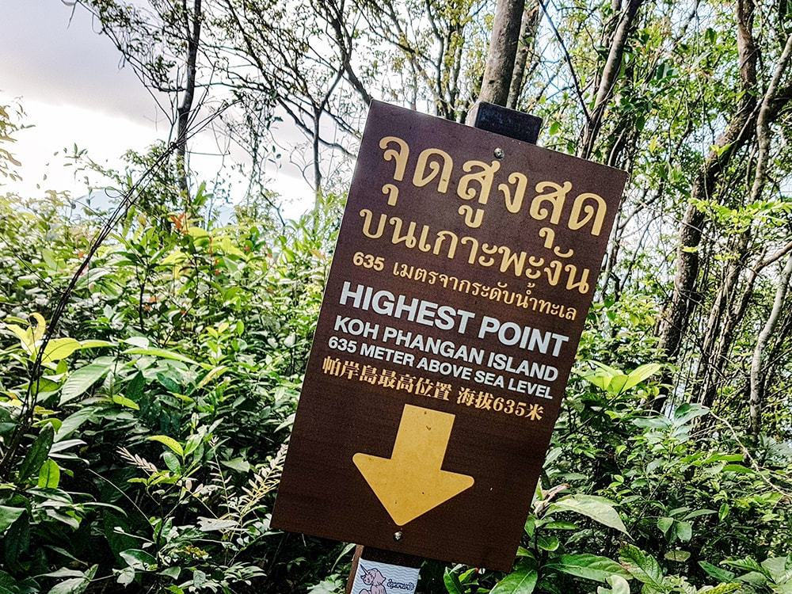
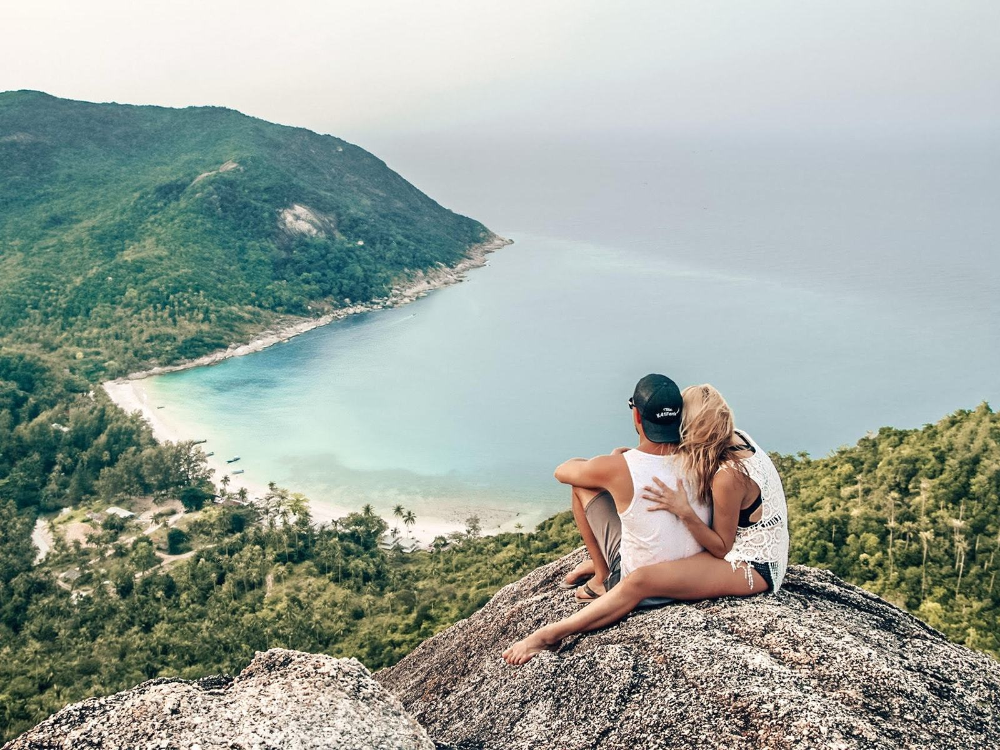
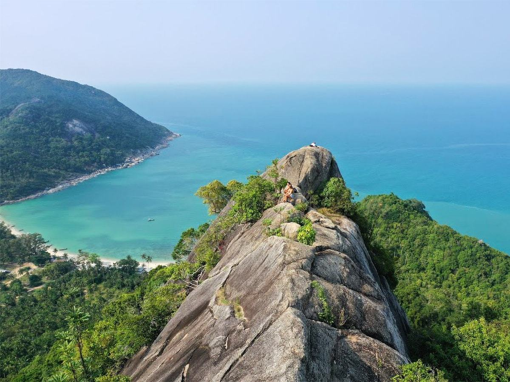
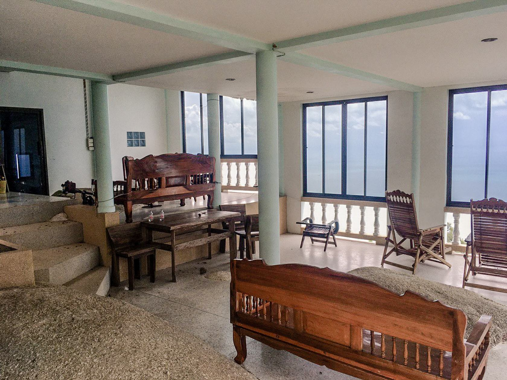

### Водопады

1. [Paradise Waterfall](https://goo.gl/maps/Zjjf7hutyeohY9wo7) Чалоклам. Водопад с небольшим озером и тарзанкой. В озере можно купаться. Вход стоит 20 бат, за это вам дают бутылку воды.
2. [Phaeng Waterfall](https://goo.gl/maps/U4LvhX197xyfNYhd8) Вход 100 бат. Там же можно подняться на вью-поинт. А еще этот водопад удобно совмещать с посещением слоника.
3. [Than Sadet Waterfall](https://goo.gl/maps/P9TrCDNwoGWAzeZf9) Находится на территории нацпарка, поэтому вход 100 бат. В нем купался сам Rama V. Видимо поэтому считается святым. Вода из него используется для церемоний. Большие красивые камни, хорошее место для йоги и фотосессий. Удобно совмещать с пляжем Тан Садет.
4. [Than Praphat Waterfall](https://goo.gl/maps/H9cgNBcFCjimcraS8) Он же Lost Paradise Waterfall. Добраться до него сложно. Находится рядом с недостроенным аэропортом и на полпути к заброшенному пляжу Haad Nam Tok.
5. [Wang Sai Waterfall](https://goo.gl/maps/8aRRdq7BJRzZ5dzC8) Если пойти по реке с валунами до конца — будет небольшое озеро с маленьким водопадом. В сухой сезон он почти пересыхает.

### Храмы

1. [Китайский храм (Chinese Temple)](https://goo.gl/maps/zp3qTRbnAZ1dqLeK8) Чалоклам. Китайский храм (Kuan Yin Temple) – возможно, самый красивый храм на острове. Вход платный – 40 бат. Находится на холме, так что это еще и вьюпоинт.
2. [Wat Paa Sang Tham](https://goo.gl/maps/AaQZ1EMNKAFZL7h27) Большой буддийский храм в Чалокламе, четыре постройки и статуя Будды. При храме есть сауна
3. [Wat Maduea Wan](https://goo.gl/maps/1tnBg9tbdjXbUiuf8) К храму ведет красивейшая лестница с драконами. Удобно совместить с посещением водопада Phaeng Waterfall.
4. [Wat Samai Kongka](https://goo.gl/maps/27rH5K3L87Syvr6f7) Красивый храм с очень неоднозначными скульптурами, изображающими сцены ада с участием туристов.
5. [Wat Khao Tham](https://goo.gl/maps/XbuzaxsesBxANzYo6) Храм на горе со множеством построек. Обилие деревьев франжипани, красивый храмовый комплекс, потонувший в зелени деревьев. А если пройти 200 метров дальше — будет чудесный вьюпоинт с видом на закат.
6. [Православный храм Серафима Саровского](https://goo.gl/maps/Hbpy3wWfeTZPPMv68) Доброжелательный священник. Службы и молебны проводятся почти каждый день. Есть возможность послужить, оказав помощь в уборке, петь на службах, звонить в колокола, оставить донейшн, приобрести иконы и книги, принести продукты или предметы домашнего обихода.
   
### Животные

На острове нет зоопарков или сафари-парков. Но есть мини-фермы, а также много дикой живности — вараны, гекконы, змеи, обезьяны. Диких слонов на острове нет, только несколько, живущих на ферме. Также есть как минимум один частный приют, который не будет против помощи.

1. [Purina Sheep Farm](https://goo.gl/maps/aheS47v7QaNzdDGK8) Мини-ферма с чистыми овечками, которых можно погладить, покормить травой и напоить молоком из бутылочки. Стоимость 200 бат с человека, детям бесплатно. К билету прилагается вода, печеньки и листья с молочком для кормления.
2. [KP Zoo Cafe](https://goo.gl/maps/bs122And7puEnoCv7) Кафе возле водопада, в котором можно попросить корм для рыб и покормить карпов в маленьком ставочке. Есть черепашки, игуаны, множество птиц и другой живности. А на другой стороне есть вольер с оленями.
3. [Ban Tai Elephant Trekking](https://goo.gl/maps/LuQ62CTXzxNtGG1X9) Слоновья ферма по дороге на пляж Тан Садет. Для любителей покататься на животных. Стоимость кормления бананами — 50 бат, стоимость 20-минутной поездки — около 900 бат.
4. [Elephant Home](https://g.page/the-elephant-home-koh-phangan) А с этим слоном обращаются куда лучше. Два раза в день (10 и 13 часов) с ним можно искупаться в озере. А также в любое время приехать покормить бананами.
5. **Вараны** Варанов можно увидеть на пляже Than Sadet. Если смотреть на море, то в самой правой части пляжа, в реке, которая впадает в море. Лучше приходить в нежаркое время, тогда выше вероятность их увидеть. Также вараны встречаются в любых местах, где есть мелкие реки, например в речке между Zen и Srithanu Beach или в речке перед пляжем Malibu в Чалокламе.
6. **Обезьяны** На восточной стороне Обезьяны встречаются по дороге на Хадрин, там где знак «не кормите обезьян», после [кафе 2401](https://goo.gl/maps/nSX4SGyQmsbHQznU8). На западе острова обезьяны приходят в [кафе Coral Bay](https://www.google.ru/maps/place/Coral+Bay+Bar/@9.7977935,100.0132888,18z/data=!4m5!3m4!1s0x3055024aaf0b018f:0xeea7b6d2d24840be!8m2!3d9.7973381!4d100.0141058?hl=ru) воровать у туристов кокосы. Вообще обезьян много в джунглях, если идти по треккинговым маршрутам. Если повезет, вы их НЕ увидите. Они могут быть агрессивны, часто кусают, а уколы от бешенства здесь очень дорогие. Подумайте, нужно ли вам их искать.
7. **Светящийся планктон** Светящийся (фитопланктон или биолюминесцентный) планктон можно увидеть ночью на восточных пляжах (Тан Садет, Тон Най Пан). Нет определенной информации, в какое время года его ловить. Но точно известно, что планктон гораздо лучше виден в безлунные ночи, когда свет от луны (или другие огни) не мешают. Надо просто взять и поехать! Также смотрите [график приливов](https://www.tide-forecast.com/locations/Ko-Pha-Ngan/tides/latest) — вам нужен прилив. Планктон светится в результате химических реакций, возникающих при механическом воздействии. Поэтому наибольшее количество света можно увидеть, активно разбрызгивая воду. Вживую планктон выглядит просто фантастически, как будто попал в мир «Аватара». Зачерпните в руки воды и бросьте ее на песок. Это нечто!

### Закатные точки

### Гора Као Ра

Гора Као Ра (Khao Ra) — самая высокая точка острова. В зависимости от физической формы подъем занимает от 1:15 до двух часов. Из-за жары и влажности подниматься после 10 утра очень тяжело. Многие предпочитают встречать рассвет на вершине, это потрясающее зрелище.

Идеально начинать подъем с 5:00 до 6:30 утра. Стартовая точка [от этого кафе](https://goo.gl/maps/J9PnQGotbPx3XTko7). По пути не будет других мест, где можно купить воду. Поэтому с собой обязательно взять литр воды и удобную обувь. Также на тропе будет много указателей, заблудиться довольно сложно.

### Bottle Beach viewpoint

Bottle Beach вьюпоинт — потрясающей красоты точка на северо-востоке острова. Это огромный камень, с которого открывается вид на бутылочный пляж Bottle Beach. Тропа довольно простая, перепад высоты всего 48 метров. Еще это отличное место, чтобы встретить закат, так как возвращаться с появлением темноты не составит труда.

Подняться на точку можно как с самого пляжа, но это занимает около часа. Либо есть более короткий путь. На байке доезжаем [до этой точки](https://goo.gl/maps/iTSJhxAypQxj6oJN7). Далее около 20 минут идем пешком [до камня](https://goo.gl/maps/fLGMkPSMTiMNm7TeA). А иногда прямо до камня вас сопроводят местные собачки.

### Недостроенный аэропорт

[На карте](https://goo.gl/maps/X7FAeZSReHXFPxmJ6)

Многие очень хотят посетить это место, так как представляют заброшенный аэропорт по фильмам: посреди джунглей стоит заброшенный самолёт, покрытый мхом и лианами. На самом деле аэропорт представляет собой выровненную часть земли без деревьев. Здесь вполне реально посадить мелкомоторный самолёт.

До аэропорта идут две тропы. По любой из них до аэропорта идти около часа. [Парковка байков](https://goo.gl/maps/jojWKbK54FXwwtpW6) на верхней тропе. Парковка [на нижней тропе](https://goo.gl/maps/GkN9iwJftfx29Ny79). Они пересекаются в районе [кафе Halfway](https://goo.gl/maps/CiKzpQhtHSdz7XRZ8). Обе тропы несложные и отлично видны на Google Maps. Советую брать с собой по полтора литра воды на человека.

В дальнем конце аэропорта находится очень красивое большое дерево. А если пройти еще пять минут — вы попадете на заброшенную виллу.

### Заброшенная вилла

На заброшенную виллу можно попасть пешком от аэропорта, либо аккуратно доехать на байке [по бездорожью](https://goo.gl/maps/EMo1vTVEGwNBp6F78) до парковки. Далее останется пройти 700 метров по песчаной дороге вверх. По пути вы увидите большие камни, огибайте их справа и двигайтесь по направлению к вилле с синей крышей. Обычно вилла стоит заброшенная и запертая, тогда обходим ее слева и залезаем через окно в кухне. Но иногда на вилле живет таец и собирает по 20 бат за посещение, пусть это не смущает

Двухэтажная вилла с балконом построена на огромных валунах, они же составляют часть ее интерьера. На первом этаже стоят деревянные кресла, из большого зала открывается шикарный вид на море. Около входной двери есть небольшой бассейн с рыбками, поэтому советую захватить с собой немного корма. На втором этаже в спальне до сих пор остался матрас. С балкона помимо вида на море видно то самое необычное дерево, растущее из камней.

