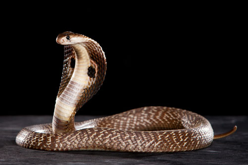
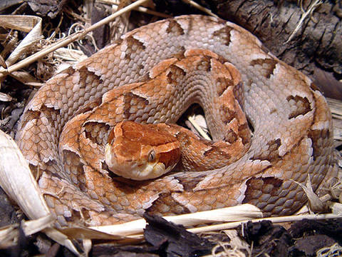
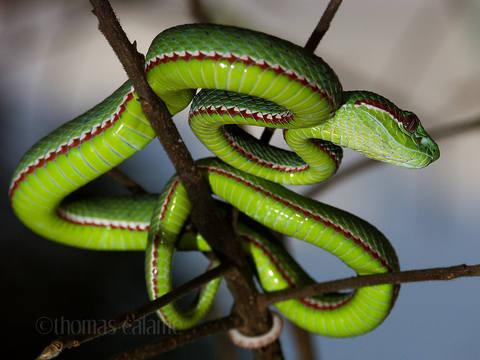

Важно знать об этих животных, чтобы оставаться в безопасности во время путешествия по Таиланду. Путешествуя по Таиланду, важно соблюдать меры предосторожности и быть в курсе того, что вас окружает, особенно при изучении природных зон. Зная об опасных животных в Таиланде и принимая соответствующие меры предосторожности, вы сможете насладиться безопасным и запоминающимся путешествием.

Если вам уже не посчастливилось столкнуться с опасным представителем фауны и нужна помощь перейдите [сюда](./docs/emergency-help)

## Змеи

Одних только змей на территории Таиланда насчитывается около 175 видов, из которых примерно 85 ядовиты, однако реальную угрозу для жизни человека представляют порядка 12 видов змей. Практически все смертельно опасные змеи Таиланда относятся к семейству аспидовых, а это кобры и крайты. Однако не только аспидовые способны нанести угрозу здоровью человека. Таиланд также густо населен гадюковыми и ямкоголовыми змеями, укусы которых могут серьезно сказаться на здоровье. В этой статье мы поговорим о семействе ямкоголовых змей, обитающих на территории Таиланда.

Стоит запомнить несколько видов ядовитых змей, включая королевскую кобру, малайскую гадюку-ямщика и зеленую гадюку-ямщицу. Этих змей можно встретить в лесах и других природных зонах по всей стране. Важно не подходить слишком близко к любым змеям, с которыми вы столкнетесь, и носить соответствующую обувь и одежду при изучении природных зон.

### Кобра (Cobra)

Считается местными самым опасным видом ядовитых змей.

Вы редко встретите кобру, бродящую по городским улицам, поскольку они предпочитают сельскую жизнь в фермерских районах и в джунглях. 
Кобр легко узнать по капюшонам, которые они раздувают, готовясь нанести удар. Также они часто предупреждают перед атакой очень громким шипением, пытаясь напугать вас звуком и сохранить яд. 

Данный вид особенно опасен из-за того, что накапливает очень много яда и выпускает при укусе почти весь запас. Взрослые особи выпустят весь яд только если вы действительно нарушите их личные границы и будете шуметь или громко двигаться. Молодые и маленькие особи еще более опасны, т.к. более агрессивны и выпускают весь яд до капли “не думая”. 

### Гадюка (Viper)

Гадюки, как правило, живут вблизи ферм и лесов. Они наиболее активны ночью, поэтому обязательно возьмите с собой фонарик, если вы находитесь в районе, где, как известно, они находятся. Известно, что змеи-гадюки стоят на своем, а не отступают, что увеличивает шансы стать жертвой укуса.

Данный вид особенно опасен из-за того, что накапливает очень много яда и выпускает при укусе почти весь запас.

### Крайт

Эти змеи обычно встречаются вблизи прибрежных районов и лесов, но иногда их замечали в более населенных районах. Крайтов можно узнать по их полосам, либо желто-черным, либо черно-белым.

### Малайский щитомордник

**Внешнее описание:** От других гадюковых эту змею отделяют по крайней мере две особенности:
- малайский щитомордник имеет гладкие чешуйки
- это яйцекладущий вид, что встречается довольно редко их сородичей

Малайские щитомордники имеют красноватую, сероватую или светло-коричневую окраску с двумя рядами больших треугольных пятен, тянущихся вдоль хребта. Между этими рядами пятен тянется тонкая темная полоса, которая может быть и нечеткой, и прерывистой у разных особей.  Верхняя часть головы имеет темную окраску, однако от носа вдоль всей головы проходят светлые полосы, образуя ровный остроугольный треугольник (его хорошо видно при виде сверху).

**Среда обитания:** С малайским щитомордником можно встретиться в прибрежных лесах, в бамбуковых рощах, а так же на заросших и неиспользуемых плантациях, фермах, садах. Они предпочитают прятаться под сухими листьями, под камнями или в старых пнях.

**Образ жизни/Характер:** Малайский щитомордник ведет преимущественно ночной образ жизни, проявляя особую активность во время дождливой погоды, но также может быть активным в течение дня. Эта змея довольно агрессивна, укус происходит молниеносно.

**Опасность:** Укусы малайского щитомордника очень болезненны, в месте укуса образуется опухоль, укус может привести к некрозу тканей. Яд этой змеи довольно сильный и в некоторых случаях может оказаться смертельным для человека.

### Куфия Поупа

**Описание:** Спина зеленая, брюхо бледно-зеленое. Первый ряд телесных чешуй – белый, создает белую полосу, протягивающуюся от головы до хвоста. Иногда перед белой может проходить красная полоса. Кончик хвоста коричневатый.  Цвет глаз может быть красным.

**Длина:** до 90 см.

**Ареал:** Центральный, Западный и Северный Таиланд, Северо-Восточная Индия, Мьянма, Северный Лаос, Малайзия.

**Среда обитания:** Куфии Поупа предпочитают холмистую местность, покрытую лесом.

**Образ жизни/Характер:** Эти змеи ведут ночной образ жизни. Днем они предпочитают отдыхать на ветвях деревьев, а ночью спускаются на землю в поисках добычи. Куфии Поупа считаются довольно агрессивными змеями, атакующими врага без колебаний.

**Опасность:** Куфии Поупа обладают очень сильным ядом! Вокруг укуса возникает большая и болезненная опухоль. Возможен летальный исход.

## Скорпионы

В Таиланде можно встретить несколько видов скорпионов, в том числе азиатского лесного скорпиона и гигантского лесного скорпиона. Эти скорпионы ядовиты и могут быть опасны, если их спровоцировать или с ними обращаться. Обязательно проверьте свою обувь и одежду на наличие скорпионов, если вы проводите время на открытом воздухе.

## Пауки

Таиланд является родиной нескольких видов ядовитых пауков, включая паука-черную вдову и паука-охотника. Этих пауков можно встретить в домах, садах и природных зонах. Важно быть осторожным, залезая в темные углы или под камни или бревна.

## Комары

Комары в Таиланде могут переносить такие заболевания, как лихорадка денге, вирус Зика и малярия. Важно носить средства от насекомых, а также брюки с длинными рукавами, чтобы избежать укусов.

## Медузы

В водах вокруг Таиланда можно встретить несколько видов медуз, в том числе коробчатую медузу и португальского военного человека. Эти медузы могут причинять болезненные укусы и, в некоторых случаях, могут быть смертельными. Важно быть осторожным при купании в океане и следовать любым предупреждающим знакам, размещенным на пляжах.

## Морские крокодилы

Морских крокодилов можно встретить в мангровых болотах и эстуариях вдоль южного побережья Таиланда. Эти крокодилы могут быть опасны, и их следует избегать.

## Азиатский гигантский шершень

Азиатский гигантский шершень (Vespa mandarinia), также известный как азиатский шершень, обитает в Таиланде. Этот вид произрастает в Восточной Азии, включая Японию, Корею и Тайвань, но распространился и в других частях света, включая Таиланд. Азиатский шершень считается инвазивным видом и известен своим агрессивным поведением и болезненным жалом. Если держать окна закрытыми и не провоцировать животное, оно, скорее всего, не тронет вас. Однако, если оно явно проявляет к вам интерес, лучше постараться скрыться. Если животное залетело в дом - вам помогут репелленты.

## Вараны

Варанов можно встретить по всему Таиланду, в том числе в городских районах. Хотя эти ящерицы обычно не агрессивны, они могут быть опасны, если их спровоцировать или загнать в угол.

# Как обезопасить свое жилище

## Содержите свой дом в чистоте и порядке

Вредителей, таких как змеи и грызуны, привлекает загроможденная и грязная обстановка. Поддерживая в своем доме чистоту и порядок, вы можете снизить вероятность привлечения этих животных.

## Устраните потенциальные укрытия

Уберите все кучи мусора или дерева, которые змеи могут использовать в качестве укрытий.
## Изолируйте места входа

Убедитесь, что все двери и окна в вашем доме оборудованы сетками и должным образом герметизированы, чтобы предотвратить проникновение вредителей.

## Установите противомоскитные сетки

Противомоскитные сетки могут помочь уберечь ваш дом от комаров и других насекомых, снижая риск заболеваний, переносимых комарами.

## Используйте средство от насекомых

Ношение средства от насекомых может помочь защитить вас от укусов комаров и других насекомых.

## Будьте внимательны к своему окружению

Исследуя природные зоны, важно быть в курсе своего окружения и следить за любыми признаками присутствия опасных животных. Носите соответствующую обувь и одежду и оставайтесь на специально отведенных дорожках.

## Храните продукты должным образом

Вредителей, таких как крысы и тараканы, привлекает пища, поэтому убедитесь, что все продукты хранятся должным образом в герметичных контейнерах.

## Используйте натуральные репелленты

Некоторые натуральные репелленты, такие как чеснок или масло мяты перечной, могут эффективно отпугивать вредителей, таких как комары и грызуны.

## Подумайте о найме службы борьбы с вредителями

Если вас беспокоят вредители в вашем доме, подумайте о найме службы борьбы с вредителями, которая поможет выявить и устранить любые нашествия.
