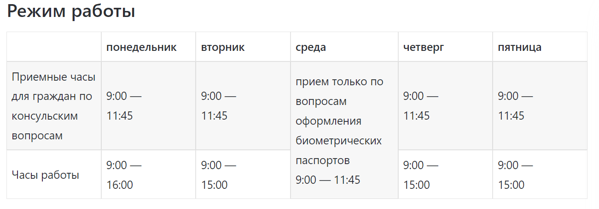
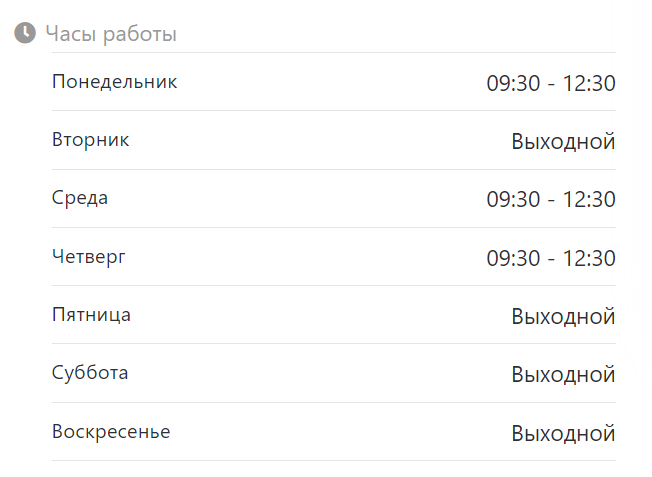

# Консульства, почетные консулы и посольства РФ в Таиланде

Посольство России в Таиланде (Бангкок)

Сайт: https://thailand.mid.ru/ 

Запись на прием: https://bangkok.kdmid.ru/queue/Default.aspx 

Почта: consulbkk@yandex.ru ( consulbkk@gmail.com  - устарел ) rusembbangkok@yandex.ru 
Телефон: (+66) 223-420-12
(+66) 2234-98-24
(+66) 2268-11-69

Адрес: 78 Sap Rd, Si Phraya, Bang Rak, Bangkok 10500
https://yandex.ru/maps/-/CCUKb8rqcA 
https://goo.gl/maps/r8Yr3MdCwxmRHMdc9 

По средам осуществляется прием заявлений на паспорта нового поколения. Прием посетителей по прочим вопросам в эти дни не ведется.

Личный прием граждан дипломатами Консульского отдела осуществляется только по предварительной договоренности.

Консульский отдел не работает в праздничные дни согласно российскому производственному календарю.

## Генеральное консульство России на Пхукете

Сайт: https://phuket.mid.ru/ 

Почта: phuket@mid.ru phuketconsul@yandex.ru 

Телефон: +66 95-259-8081

Адрес: 63, 501 Moo 2 Thepkasattri Road, Kohkaew, Mueang Phuket District, Chang Wat Phuket 83100

https://goo.gl/maps/8y3n3D1Gzd5noMiQ8 
https://yandex.ru/maps/-/CCUKbTQSwA 

В настоящее время в Генеральном консульстве России в Пхукете совершаются следующие консульские действия:

1. Нотариат:
- свидетельствование верности копий документов и выписок из них;
- свидетельствование подлинности подписи на документах;
- свидетельствование верности перевода документов с английского или тайского языков на русский язык и с русского языка на английский или тайский языки

2. Удостоверение подлинности подписи на аффидевитах о месте жительства в Таиланде / о ежемесячном доходе / о браке

3. Оформление согласий и заявлений:
- на вывоз/выезд ребенка за пределы Российской Федерации;
- о постановке на регистрационный учет

4. Легализация документов

Все консульские действия производятся строго по предварительной записи по электронной почте в приемные дни: понедельник, среда, четверг с 9:30 до 12:30.

За совершение консульских действий взимаются консульские сборы согласно утвержденному тарифу сборов. Уплата консульских сборов будет производиться в таиландских батах с использованием выдаваемой Генконсульством банковской квитанции. Оплатить квитанцию можно в ближайшем отделении банка «Bangkok Bank» по адресу: 92/26-27 Moo 2, Kohkaew, Muang, Phuket.

Платежи банковскими картами и наличными денежными средствами Генконсульством не принимаются!

ВНИМАНИЕ! Генеральным консульством на данном этапе НЕ ОСУЩЕСТВЛЯЕТСЯ ОФОРМЛЕНИЕ следующих документов:
- общегражданские заграничные паспорта;
- все документы ЗАГС (свидетельства о браке, рождении, перемене имени и др.);
- свидетельства на возвращение;
-Также не совершаются нотариальные действия по удостоверению всех видов сделок, в том числе оформляемых в виде согласия супруги(а) на значимые сделки, выдаче всех видов доверенностей, оформления завещаний, свидетельствованию подлинности подписи на документах о принятии/отказе наследственного имущества, согласиях о приватизации, заявлениях об отзыве доверенностей и ряде других документов. 
- Для оформления указанных документов необходимо обращаться в консульский отдел Посольства России в Таиланде.

## Почетное консульство России в Паттайе

Сайт: https://www.facebook.com/rusconsul/ 

Почта: rusconsul@royalcliff.com 

Телефон: (+66) 3825-04-21

Адрес: 353 Phra Tamnak, Pattaya City, Bang Lamung District, Chon Buri 20150, отель «Royal Cliff Beach Resort», корпус «Royal Cliff Grand», 1-й этаж

https://goo.gl/maps/cdcNo8yvpiZwb7vj6 

## Почетное консульство России на Самуи

Сайт: https://www.facebook.com/HonoraryConsulRF 

Почта: rusconsulsuratthani@amburaya.com 

Телефон: (+66) 7741-88-84 

+66 95 414 5040

Адрес: 4/1 Moo 1 Tambol Maenam, Surat Thani, Koh Samui, 84330, гостиница «W Retreat Koh Samui»

https://goo.gl/maps/E5RJ9eFqRbrFy3rLA 

# Как сделать новый загранпаспорт в Таиланде

Если вы решили сделать второй загранпаспорт в Таиланде, то будьте готовы к тому, что это можно будет сделать только посетив Бангкок и что процесс займет порядка 12 месяцев.

Окна в посольстве можно занять только на ближайшие пару месяцев, и все они сейчас заняты. На текущий момент вы можете только записаться на очередь в очередь. В любом случае, если вы твердо намерены выполнить это действие, вам стоит проверять доступные для записи окна пару раз в день - периодически некоторые записи “отваливаются” и их можно занять.

### Что делать при утрате документов

Порядок действий в случае утраты загранпаспорта:

1. Обратитесь в полицию. 

В Таиланде лучше обратиться именно в туристическую полицию. Вам потребуется копия заявления/отчета из полиции.

Если паспорт был утрачен в результате кражи, об этом обязательно нужно заявить. Более того, часто грабители оставляют где-то неподалеку паспорт, потому что знают что за ним будут гоняться охотнее, чем за имуществом.

Если в результате потери, то все равно об этом нужно заявить.

Также они могут сориентировать вас о том, как быть дальше и что нужно делать именно в той стране, где вы находитесь.

2. Обратитесь в консульство или посольство

Выберите, что для вас ближе и что удобнее. Если в городе, где вы сейчас находитесь, нет ни того, ни другого и даже почетного консула - придется ехать в другой город. Перед поездкой желательно связаться с выбранной организацией и уточнить, смогут ли они вам помочь.

3. Если у вас не осталось ни одного легитимного документа - сначала вам придется подтвердить свою личность в выбранном учреждении.

Процесс может занять до 27 дней. Его можно ускорить, если вам удастся уговорить пройти с вами двух соотечественников, имеющих загран.паспорта и готовых поручиться за ваши заявления о собственной личности.

4. Получите Свидетельство На Возвращение (СНВ) в выбранном консульстве/посольстве

5. Получите разрешение на нахождение в стране

Если вы находитесь в визовой стране (которой является Таиланд), вам потребуется обратиться в ближайший иммиграционный офис для получения обоснования на нахождение в стране. 

### Как отдыхать со свидетельством на возвращение
Свидетельство на возвращение за границей заменяет вам паспорт.
Обычно с ним можно спокойно отдыхать еще 14 дней. После по нему нужно въехать на территорию России. В течение трех дней после въезда свидетельство сдают в отделение ФМС, чтобы получить новый загранпаспорт.
Со свидетельством не получится поехать в другую страну — вас развернут на границе. Если вы летите домой с пересадкой через безвизовые страны — вас пропустят без проблем, даже если у вас несколько стыковок. Но если вы делаете пересадку в стране, для которой нужна виза, — могут быть проблемы. Тогда лучше всего возвращаться домой прямым рейсом.

## Как сделать доверенность из Таиланда

Доверенность можно оформить в Бангкоке и на Пхукете у консула. Возможно, получится оформить и в почетных консульствах в Паттайе и на Самуи, но шансы невелики. Тонкости подачи можно узнать на сайте консула. 

### Про генеральные доверенности

В тексте доверенности лучше всего через запятую перечислить все виды предполагаемых конкретных действий, которые могут потребоваться. Так ведомство в РФ не сможет отказать по причине отсутствия действия в доверенности. При сделках с жильём и авто есть шанс что абстрактная генеральная не подойдёт. Вписать стандартный текст "может проводить сделки купли продажи недвижимости" достаточно просто и нет причин не делать. Большинство гос.органов в России придерживаются позиции, что "разрешаю все" – недостаточно идентифицирует конкретные полномочия. Это скорее осмысленная позиция – в противном случае злоумышленник мог бы по вашей генералке продать вашу квартиру, получить деньги и отдать их в управление своему трасту на 99 лет, и вы не смогли бы это оспорить, потому что разрешили ему все. Ну и более технический момент; нотариус должен убедиться в том, что вы осознаете по крайней мере прямые последствия своего волеизъявления; при генеральной доверенности ему бы пришлось перечислять тебе все возможные штуки, которые в принципе от твоего имени можно делать, чтобы убедиться, что ты их понимаешь. В целом это тот правовой эффект, который обычно не нужен вообще никому, поэтому любому гос.органу проще человека с генеральной доверенностью развернуть, чем потом получить неприятности, когда сделку оспорят и ему придется все разворачивать.
