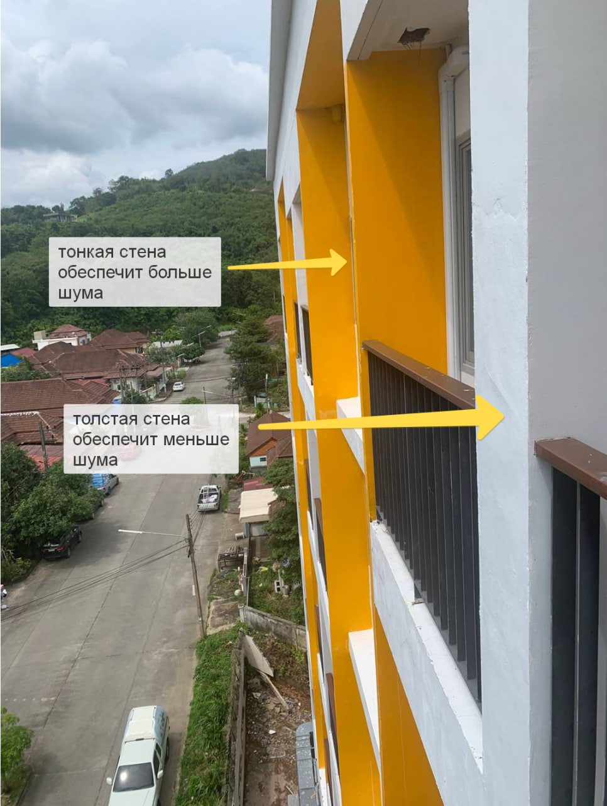

# Как арендовать отели в принципе

Субъективный топ сайтов:
- [**Google Maps**](https://www.google.com/maps/)
- [**Booking**](https://www.booking.com/)
- [**Agoda**](https://www.agoda.com/)

[**Google Maps**](https://www.google.com/maps/) подходит для тех, у кого есть нормально работающая иностранная карта. На этих картах удобно найти отели в каком-то районе свободные на определенные даты. Но самое главное, когда отель уже выбран, очень полезно открыть его на картах гугл и посмотреть списком предложения по аренде номера от разных сервисов. Иногда попадается существенная разница.

В [**Booking**](https://www.booking.com/) можно отфильтровать результаты, не требующие привязки кредитки и без штрафов за оплату. Если вы еще в пути, и альтернатив букингу на ру карту не удалось найти, то лучше поступить так:
1. Найдите и забронируйте понравившееся жилье. Если из нормальных вариантов нет доступных к оплате на месте, придется пойти на хитрости.
2. Дайте доступ к аккаунту знакомым или друзьям, пусть они привяжут карту, забронируют жилье и затем отвяжут ее. Поменяйте пароль аккаунта, и договоритесь с владельцем что оплатите наличными на месте. Это необходимо для того, чтобы они не пометили вашу бронь как неосуществимую и вы ее не лишились.
3. На всякий случай забронируйте запасное жилье (даже если оно не очень) на пару-тройку дней с оплатой на месте и бесплатной отменой до следующего дня от дня вашего прилета. 

[**Agoda**](https://www.agoda.com/) особенно интересна тем, что позволяет провести оплату наличными через магазины типа 7-11 или Big C, по крайней мере в странах ЮВА. К тому же, на данный момент их программа кешбека позволяет приятно сэкономить, и с его учетом получается дешевле на 2-5% чем на букинге.

# Как арендовать частное жилье

Под частным жильем мы имеем в виду различные кондо (квартиры в ЖК), дома и гестхаусы.

Есть две принципиально разных тактики:
1. Аналоговый поиск.
Можно перемещаться (лучше на байке) по выбранному району, заходить в кондо и на рецепции спрашивать, кто что у них сдает. Можно искать объявления на домах, или спрашивать у охранников на входах в жилые кварталы (часто дома расположены огороженной группой с охраной). 

2. Цифровой поиск.
Вы можете воспользоваться одним из сайтов, указанных ниже, или искать ЖК (кондо) с хорошими отзывами на картах и звонить им на рецепшн с вопросом, не сдает ли кто-то из владельцев номера.
Также часто можно найти объявления о пересдаче в русских ТГ чатах. Но будьте осторожны, учитывайте что шанс скама от соотечественников на данный момент даже выше, чем от тайцев.

## Сайты для поиска жилья

Если вы начинаете заниматься поиском жилья у простых тайцев, особенно в курортных местах, первое что вам нужно понять - это бесконечный сабай. Он превыше любой выгоды. На выходных вам никто не ответит и не встретится с вами. Слишком поздно и слишком рано - тоже не ответят и потом уже забудут прочитать. Договариваться с тайцем неделю-две чтобы встретиться посмотреть жилье - это нормально. Агенты более расторопны, с ними можно договориться уже на следующий день или даже день в день.

Кроме этого нужно конечно помнить про недопустимость потери лица, улыбку в качестве вежливости и обязательный ответ на “вай”.

Субъективный топ для поиска жилья:
1. [Facebook Marketplace](https://www.fb.com/marketplace) Сервисом активно пользуются как местные так и фаранги, пересдающие жилье и покидающие страну. Мониторить нужно каждый день, хорошие предложения улетают за пару часов. И наоборот, если предложение висит больше 14 дней, вряд ли вам даже ответят на вопросы по объявлению. Очень часто никто просто не отвечает. 
2. [AirBnB](https://www.airbnb.ru/) Классический прием - договориться о встрече через ЭирБнБ и арендовать за налик мимо самого сервиса. Или арендовать с сервисом на 1-3 дня, а дальше - договориться с владельцем за налик.
3. [FazWaz](https://www.fazwaz.com/rent) Отлично подходит для долгосрочной аренды заранее. На сервисе часто выставлены объекты, освобождающиеся через 1-6 месяцев. Цены на 6/12 месяцев отличные, абсолютно рыночные без наценок но и без скидок, которые можно поймать от уезжающих фарангов, арендовавших жилье в лоусизон
4. [DD Property](https://www.ddproperty.com)
5. https://www.hipflat.co.th/ru
6. https://www.renthub.in.th/
7. https://www.bahtsold.com/ 

## Как обезопасить себя

Разумеется, желательно не заключать сделок дистанционно. Старайтесь сделать так, чтобы заключение сделки прошло в месте аренды. Если это отель или кондо - заключение сделки должно проходить на рецепшине с участием главного менеджера или хотя бы менеджера с рецепшина. Если это частное жилье - то вы обязательно должны убедиться что у сдающего есть доступ в это жилье. 

При заключении аренды с частным собственником (не с организацией) у собственника можно попросить показать оригиналы права на собственность и Thai ID. В тексте права на собственность по идее где-то должен дублироваться Thai ID. 

Важно понимать, что документы не несут никакой почти нагрузки, полагаться на них как на надежную защиту не стоит. К тому же, договор заключается на английском, а законы страны – на тайском. По сути это и не документ вовсе, но, насколько я понял, полицией все же рассматривается как подтверждение соглашения. Иногда попадаются юридически верно составленные договора на тайском с прилагающимся к ним переводом на английский. Для того, чтобы тот факт, что текст на английском является именно переводом, и текст на тайском обязан по смыслу ему соответствовать, не был догадкой - это должно быть прописано в договоре. В противном случае перевод может расцениваться как дополнительные пункты к основному договору, а не их перевод. 
Также важно помнить, что в спорных ситуациях (кроме откровенного мошенничества) закон всегда на стороне тайца. С другой стороны, в туристических местах следят за тем, чтобы туристам не делали сильно плохо, т.к. это вредит престижу всего региона. 

В целом, я еще ни разу не слышал о случае, когда таец сильно обманул клиента. Но и не стоит рассчитывать что они святые. Чаще всего максимум это увеличенные коммунальные тарифы, или завышенные счетчики, отсутствие каких-то оговоренных услуг (например уборка). 

Очень редко бывают случаи отказа возврата залога. В таких случаях постарайтесь вежливо и спокойно стоять на своем. Укажите, что это несправедливо. Затем укажите, что это не законно и у вас есть договор. Попробуйте дать тайцу какой-то срок на возврат депозита, если это возможно. Очень часто их нежелание отдавать депозит связано просто с тем, что у них нет на это средств. Продолжайте уговаривать и стоять на своем, часто им становится просто лень с вами спорить. Если ничего не помогло - укажите, что обратитесь в туристическую полицию и что это мошенничество.

Но ни в коем случае не повышайте голос и не переходите в агрессию - помните о сохранении лица. Последствия могут быть даже летальными для вас. Такие случаи периодически происходят, и потом извиняются все на свете а виновник очень строго наказывается, но вам не станет от этого лучше.

Образцы договоров:
1. [Документ 1](../../static/pdf/Clean_Agreement_Contract.pdf)
2. [Документ 2](../../static/pdf/Draft_contract.pdf)

# Советы по выбору номера

Чтобы понять, какая слышимость будет у вас с соседним номером -  выйдите на балкон и посмотрите, какая стена отделяет вашу спальню и соседа. В здании есть несущие толстые конструкции и есть тонкие перегородки в один кирпич, или вообще гипсовые. Выбирайте жилье так, чтобы между спальней и соседом была толстая стена. Либо, если есть возможность, пусть спутник зайдет в соседний номер и крикнет там что-то. Как вариант - постучать по стене, звук не должен быть звонким. Слышимость в гостиницах часто переходит все разумные пределы. 

*Лайфхак:* Можно удачно находить жилье, если добавлять агентов из объявлений с https://www.ddproperty.com  и уже у них спрашивать доступные варианты по параметрам