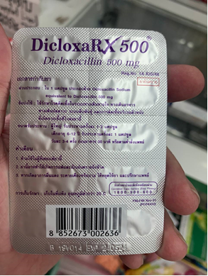
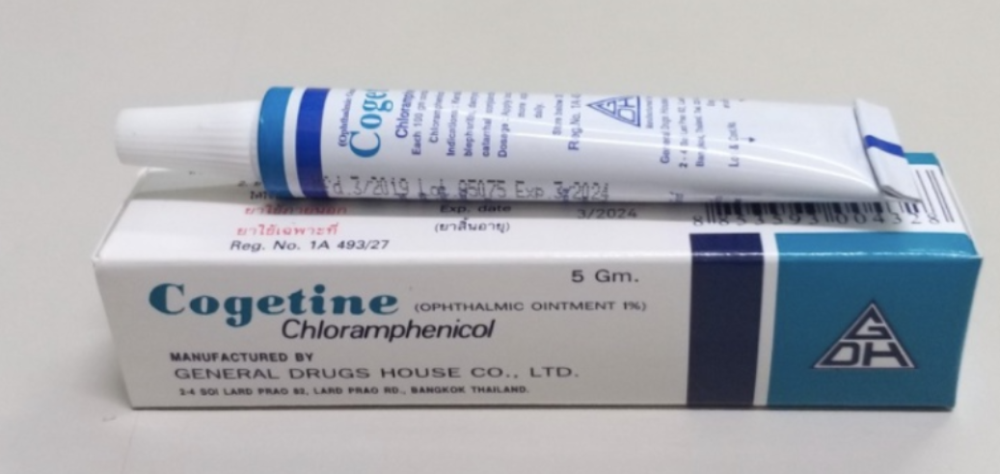
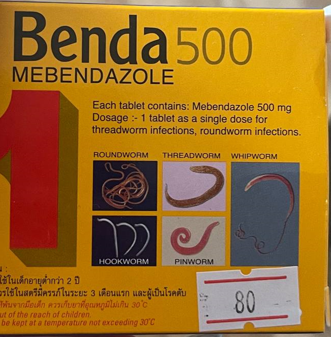

В Таиланде достаточно хорошо развита фармацевтика и импорт зарубежных препаратов. Большинство “бытовых” препаратов имеются в продаже, и найти их можно назвав международные названия нужных вам действующих веществ или описав проблему, от которой вам требуются медикаменты. Фармацевты почти всегда достаточно хорошо говорят на английском (что удивительно), и готовы помочь. Конечно, они стараются продать фарангу лекарства получше и подороже, но даже по сравнению с фармацевтами РФ - местные более честны.

Однако будьте бдительны, в Таиланде часто можно встретить подделки, особенно дорогих лекарств. Чем лучше выглядит аптека, и чем серьезнее сеть, тем меньше шансов на получение подделки. И тем меньше шансов, что вам продадут то, на что нужен рецепт или то, что формально запрещено. Лучше всего соответственно покупать рецептурные препараты в госпиталях крупных сетей, там они будут стоить дешевле чем в аптеке без рецепта и надежнее, но без рецепта вам их не продадут вообще. 

Также будьте аккуратны покупая обезболивающие препараты и антидепрессанты. Тот факт, что вам их продали в той или иной аптеке, не означает того, что вы легально можете носить их с собой. Бывали случаи очень крупных “штрафов”, полученных от блюстителей порядка, даже когда видно, что человек травмирован.

Так же стоит учесть что многие антидепрессанты в Таиланде стоят во много раз дороже, так что если вы ещё не уехали и вам они нужны, лучше сразу запастись большим запасом.

Перед применением обязательно проконсультируйтесь с врачом или хотя бы ближайшим фармацевтом про конкретно ваш случай. У всех индивидуальный организм, с индивидуальными непереносимостями. **Не занимайтесь самолечением.**

Многие лекарства по названию интернациональны. Ниже список популярных аналогов:
- **Paracetamol** - от температуры
- **Tofago** - от головной боли (как пенталгин)
- **Deltacarbon** - активированный уголь
- **Ibuprofen** - болеутоляющее
- **Deolin** - от спазмов (как ношпа) 
- **Smecta** - при отравлении
- **Tiziyne** - от насморка
- **Betadine** - йод 
- **Bepanthen** - спасает от ожогов
- **Amiodarone Aguettant** - успокоительное (аналог корвалола)
- **Chlorhexidine** - хлоргексидин для промывки ран и ссадин
- **Hydrogen peroxide** - перекись водорода
- **Miramistin** - мирамистин для дезинфицирования
- **Tobramycin (tobramycin), Tobrex, Vesoph, Chlorcil, Poly-Oph, Besivance, Vigamox** - капли от конъюнктивита, но уже с антибиотиком широкого спектра действия, для лечения бактериальных инфекций.
- **Tetracyclinum** - антибиотики наружного применения

## Лекарства, рекомендованные местными фармацевтами

Далее вы увидите изображения лекарств и комментарии к ним от фармацевта. Перед применением обязательно проконсультируйтесь с врачом или хотя бы ближайшим фармацевтом про конкретно ваш случай. У всех индивидуальный организм, с индивидуальными непереносимостями. **Не занимайтесь самолечением.**

Air-x от вздутия

От системных бактериальных поражений
4 таблетки в день 5 дней

От ячменя на глазу (прыщик на глазу, волдырь, гнойник)
2 раза в день, утром и вечером, пока не пройдет. 
Не пальцами! либо ватной палочкой, либо сразу из тюбика на глаз. 
Хорошо помогло, за один день все прошло.

От респираторных заболеваний и не только, природный иммуностимулятор.
4 раз в день , от 2 до 4 таблеток, зависимо от интенсивности заболевания. В течение 5 дней.

Хорошее средство от паразитов.
Для проживающих в Таиланде рекомендуется периодическая терапия от паразитов для профилактики (раз в 6-12 месяцев).

## Первая помощь при падении с байка

Ссадины, царапины,  ушибы можно лечить самостоятельно, если есть сомнения, лучше обратиться к врачу. При сложных случаях (переломы, кровотечения, удары головой) обращаться в госпиталь.

### Обработка ран и ссадин:

- обработать руки спиртовым раствором;
- промыть рану проточной водой;
- промыть хлоргексидином **(Chlorhexidine)**, мирамистином **(Miramistin)** или перекисью водорода **(Hydrogen peroxide)**;
- обработать края раны растворами йода **Betadine**, **Povadine**;
- посыпать порошком антибиотика на рану (**Banocin powder**, **Pises Powder**);
- перевязать рану стерильным бинтом.

# Противоядия
Противоядия токсичны для человеческого и других организмов и могут привести к летальному исходу, не рекомендуется принимать их вне госпиталя и без консультации с врачом.

Под каждого типа яда требуется свое противоядие:

- Сыворотка против змей Гематотоксичная поливалентная. Для азиатских змей, таких как малайская ямная гадюка, Зеленая ямная гадюка, гадюка Рассела.
- Сыворотка против змей Нейротоксичная поливалентная Для Кобры, Королевской кобры, Полосатого Крайта, Малайского крайта

Единственные укусы, действительно требующие незамедлительного лечения - это укусы Королевской кобры. В остальных случаях у вас есть час, чтобы добраться до госпиталя или дождаться скорой реанимации.

У противоядий очень короткий срок хранения, и их необходимо надлежащим образом хранить в специальном холодильнике для вакцин, поддерживающим бесперебойно температуру 2-6 градусов. Они действительно опасны, т.к. получаются из иммунных систем животных, и должны назначаться под наблюдением врача из-за серьезных реакций у значительного числа людей. В теории применение противоядия может быть летальным для слабых организмов.

Многие применяют противоядия для своих животных. Для животных в случае проявления тяжелых симптомов возможно применение неправильно хранящихся вакцин, как меньшее из двух зол. 

Рассмотрите применение инъекционного витамина Ц, некоторые сообщают, что он может помочь от яда гадюк. 

Если же вы решили приобрести противоядие для человека, вы можете обратиться в крупнейшие государственные госпитали рядом с вами. Возможно, вам продадут их в небольшом количестве.

Если вы решили приобрести противоядие для животного, вы можете спросить в сети магазинов PAWS или крупных ветклиниках. Эти противоядия категорически запрещены к применению на людях.
